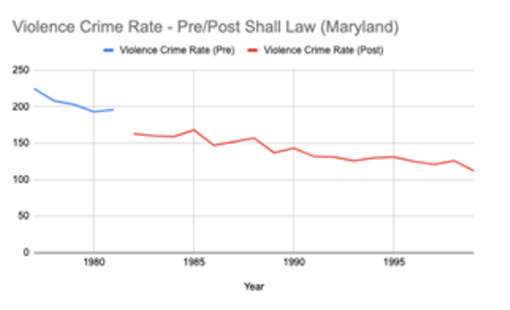
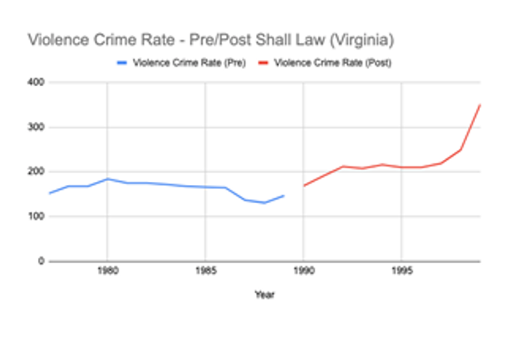

# Stata-analysis: Understanding the Impact of Shall Carry Laws on Crime Rates using Time Series Fixed Effects Model

In this project, I conducted a comprehensive investigation into the relationship between Shall Carry Laws in the United States and crime rates. Leveraging data from [Princeton University's Stock-Watson Empirical Exercises datasets](https://www.princeton.edu/~mwatson/Stock-Watson_3u/Students/Stock-Watson-EmpiricalExercises-DataSets.htm), I applied a time series fixed effects model to unravel patterns and discern the impact of various factors on crime rates.

## Key Components:

- **Exploratory Data Analysis (EDA) in Stata:**
  - Initiated the project with a meticulous EDA in Stata to gain insights into trends and patterns in the data.
  - Explored statistical summaries, visualizations, and correlations to inform subsequent steps.

    

       <!-- Adding line breaks for spacing -->

    

- **Data Preprocessing:**
  - Addressed issues related to data distribution and multicollinearity through preprocessing techniques.
  - Ensured the quality and reliability of the data before proceeding with model development.

- **Model Building:**
- Built a pooled OLS model first to understand the relationship between crime rates and shall carry laws. Since a Pooled OLS Model cannot capture the heterogeneity of different samples, we used a fixed effects model

- The general form of a fixed effects model is as follows:

   Yit=β0+β1X1,it+β2X2,it+γ2D2i+γ3D3i+ αi ⋯+uit

   where:
   X1, X2 = Variables that are time-dependent
   γ = Dummy variable coefficient for each entity which captures the heterogeneity
   uit  = Idiosyncratic error Term
   αi  = Fixed effects term.
   A demeaned within-groups regression was done on the data and hence the αi (fixed effects) term was eliminated.

