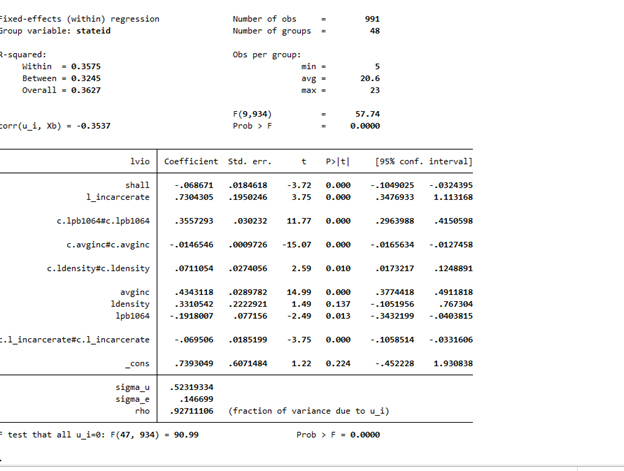
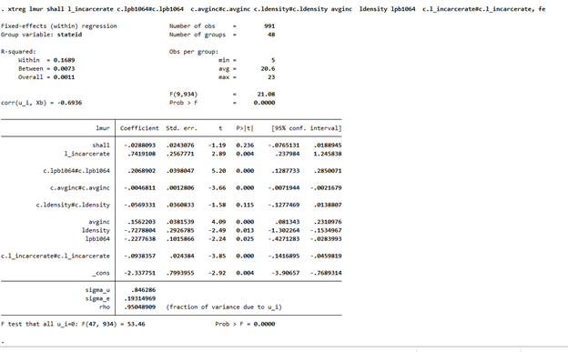
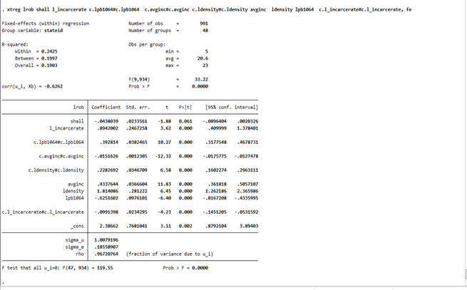

# Stata-analysis: Understanding the Impact of Shall Carry Laws on Crime Rates using Time Series Fixed Effects Model

In this project, I conducted a comprehensive investigation into the relationship between Shall Carry Laws in the United States and crime rates. Leveraging data from [Princeton University's Stock-Watson Empirical Exercises datasets](https://www.princeton.edu/~mwatson/Stock-Watson_3u/Students/Stock-Watson-EmpiricalExercises-DataSets.htm), I applied a time series fixed effects model to unravel patterns and discern the impact of various factors on crime rates.

## Key Components:

- **Exploratory Data Analysis (EDA) in Stata:**
  - Initiated the project with a meticulous EDA in Stata to gain insights into trends and patterns in the data.
  - Explored statistical summaries, visualizations, and correlations to inform subsequent steps.

    

       <!-- Adding line breaks for spacing -->

    

- **Data Preprocessing:**
  - Addressed issues related to data distribution and multicollinearity through preprocessing techniques.
  - Ensured the quality and reliability of the data before proceeding with model development.

- **Variable description:**
  lvio - Violence Rate (logged)
  lmur - Murder Rate (logged)
  lrob = Robbery Rate (logged)
  shall - A dummy variable indicating the presence of shall carry law in a particular state
  avginc - Average Income in a particular state
  lpb1064 - Percantage of black population in the state (logged)
  l_incarcerate - Incarceration rate (logged)
  ldensity - Population density (logged)
  
  

- **Model Building:**
  - Built a pooled OLS model first to understand the relationship between crime rates and shall carry laws. Since a Pooled OLS Model cannot capture the heterogeneity of different samples, we used a fixed effects model

  - The general form of a fixed effects model is as follows:

   Yit=β0+β1X1,it+β2X2,it+γ2D2i+γ3D3i+ αi ⋯+uit

   where:
   X1, X2 = Variables that are time-dependent
   ,γ = Dummy variable coefficient for each entity which captures the heterogeneity
   ,uit  = Idiosyncratic error Term
   ,αi  = Fixed effects term.
   A demeaned within-groups regression was done on the data and hence the αi (fixed effects) term was eliminated.

   - **Results obtained:**
 
   - Fixed effects Regression - I – Violence Rate
        <!-- Adding line breaks for spacing -->
     
 
        <!-- Adding line breaks for spacing -->
   -  The following equation was obtained after regressing violence rate:
      lvio = -0.068*shall + 0.73*l_incarcerate – 0.069* (l_incarcerate)2 – 0.191*lpb1064 + 0.355* (lpb1064)2 + 0.434*avginc – 0.014* (avginc)2 + 0.33*ldensity + 0.07*(ldensity)2+0.733
   -  From the beta coefficient, it can be interpreted that shall carry laws lower the violence by 6.8%. This variable is also significant.

        <!-- Adding line breaks for spacing -->

    - Fixed effects Regression - II – Murder Rate
        <!-- Adding line breaks for spacing -->
     
 
        <!-- Adding line breaks for spacing -->
   -  The following equation was obtained after regressing murder rate:
      lmur = -0.0288*shall + 0.741*l_incarcerate – 0.039* (l_incarcerate)2 – 0.222*lpb1064 + 0.20* (lpb1064)2 + 0.156*avginc – 0.004* (avginc)2 -0.72*ldensity + 0.056*(ldensity)2 – 2.33
   -  As per this equation, shall carry laws do lower the murder rate by 2.8%. However, the variable isn’t significant at t value of -1.19. More data is required to understand the true relationship between murder rate and shall carry laws

         <!-- Adding line breaks for spacing -->

   -  Fixed effects Regression - III – Robbery Rate
         <!-- Adding line breaks for spacing -->
      

         <!-- Adding line breaks for spacing -->
    -  The following equation was obtained after Robbery murder rate:
    -  lrob = -0.043*shall + 0.89*l_incarcerate – 0.0991* (l_incarcerate)2 – 0.625*lpb1064 + 0.392* (lpb1064)2 + 0.43*avginc – 0.0151* (avginc)2 +1.81*ldensity + 0.22*(ldensity)2 – 2.38
 
    -  As per this equation, shall carry laws lower the murder rate by 4.3%. However, this variable isn’t statistically significant at t value of -1.88. More data is required to understand the true relationship between robbery rate and shall carry laws

   - **Conclusion:**
     More data is needed to understand the true relationship between shall carry laws, murder rate, and robbery rate since the variable was not significant. However, it’s clear that shall-carry laws do lower the violence rate.
     The idea behind shall carry laws is so that the public can protect itself from criminals who use guns to their advantage.
     Since guns lower violence rate, Shall Carry Laws should not be banned. However, strict measures should be taken while issuing guns to the public, such as thorough scanning of the individuals buying them. It has been seen that most people involved in mass shootings      are those who have a mental illness or have had a history of mental illness. 
     Another measure such as linking SSN with gun-license is also a commendable effort.
     Also, strict measures should be taken to see to it that guns are not issued to minors.
     Public places and public transportation should have a better security and screening processes.
     Overall, there is a significant opportunity to improve gun control through additional measures and further research the impact of these measures while also looking at improving security at higher-risk places. 
    

